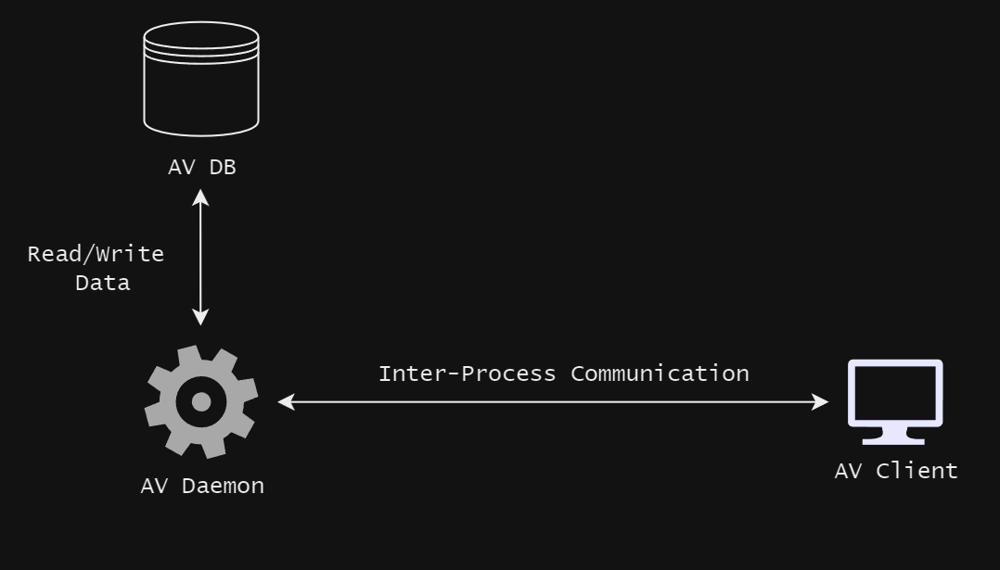
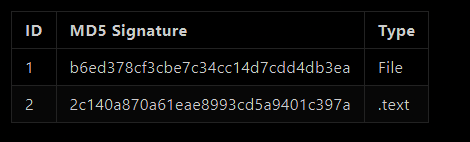

# **Basic Anti-Malware Software**

## **Features**

* Static Analysis, including:
  * signature-based detection (checking file hashes, section hashes, etc.)
* Dynamic Analysis (maybe in the future)
* Quarantine Mechanisms

## **Used technologies**

* C
* SQLite
* Linux

## **Architecture**

|  |
|:--:| 
| *Picture 1. AV Architecture* |

* **AV Daemon** - main component responsible for monitoring system, scannig files, executing quarantine mechanism. It runs in background as daemon (child process of init).
* **AV Client** - component responsible for receiving e.g.: scan results, quaranitened files 
* **AV DB** - database contains: 
   * signatures of malicious files and theirs hashed sections
   * encryption keys for quarantined files

## **Signature storage**

All signatures are stored in SQLite database in `maams.db` file.

||
|:--:| 
| *Picture 2. Table with signatures* |

Type indicates if the provided signature is the signature of file or e.g. .text section of a file.

## **Scanning process**

1. AV awaits for an event such as: downloading file from internet, copying file from external disk.
2. AV calculates MD5 hash of that file and its sections (if it is an executable)
3. If file is infected, the quarantine mechanism is executed.

## **Quarantine mechanism**

Whenever AV detected that scanned file is malicious, it takes the following steps:
1. AV logs the event includig details about file, detection time, reason of quarantine..
2. File is encrypted.
3. All permissions of that file are dropped to `000`. 
4. Owner of a file is changed to dummy user with no privileges.
5. File is moved to `/var/lib/av/quarantine/`
6. User is notified with possible malware.

